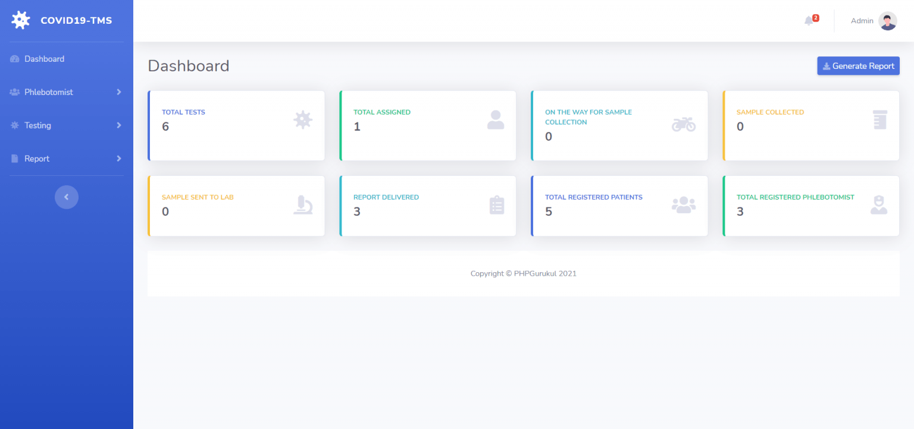
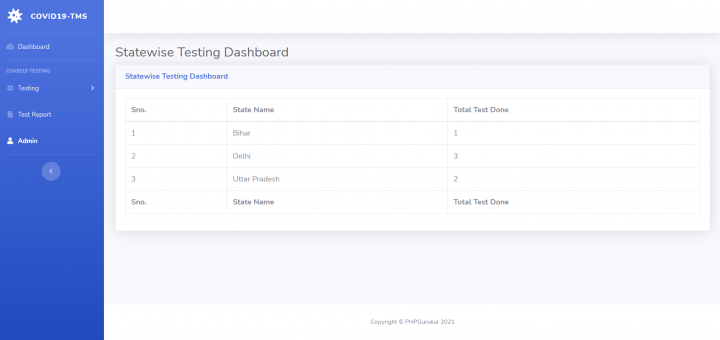
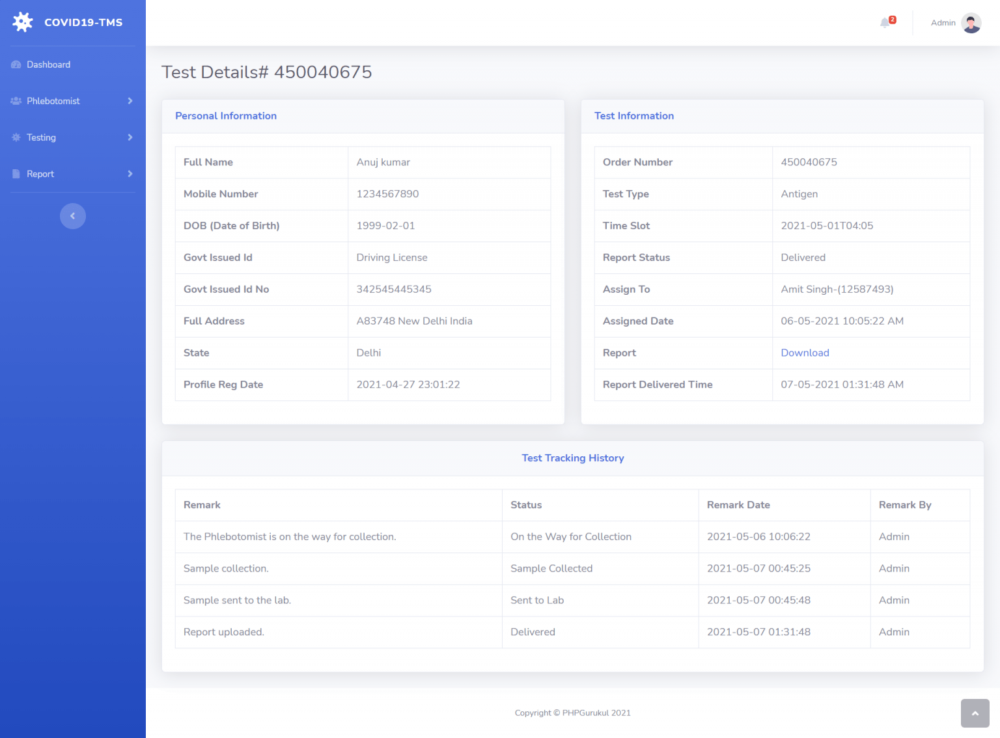
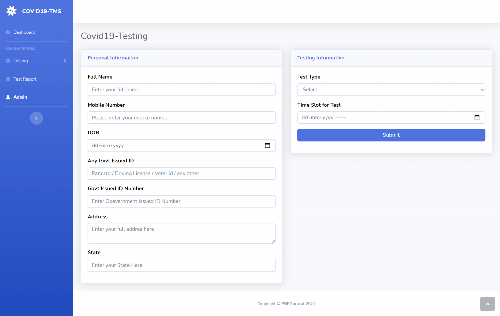

# 🦠 COVID-19 Testing Management System

**COVID-19 Testing Management System** is a web-based application developed using PHP and MySQL to manage COVID test requests, assignments, and report tracking. It includes two user roles: **Admin** and **Patients**, allowing streamlined control over the entire process.

This project was developed for **academic purposes** to demonstrate the use of server-side scripting and relational databases in real-world healthcare use cases.

---

## 📌 Project Overview

- Project Title: COVID-19 Testing Management System  
- Purpose: Academic Project  
- Development Type: Web application developed during academic learning  

---

## 🛠️ Technologies Used

- Frontend: HTML, CSS, JavaScript, jQuery, AJAX  
- Backend: PHP  
- Database: MySQL  
- Platform: XAMPP 
- Supported Browsers: Chrome, Firefox, Opera

---

## 👤 User Roles and Features

### 👨‍⚕️ Admin Module

- Secure login
- Dashboard to view test statistics (total, assigned, collected, completed)
- Add, update, delete phlebotomist details
- Assign tests and update test history
- Generate reports by date range or search (order number, name, mobile)
- Notification alerts for new test requests
- Update profile, change password, recover password

### 🧑‍💼 Patient Module

- Request testing (new users fill full form; registered users fill only test info)
- Search test reports by order number, name, or mobile number
- View dashboard with state-wise test data

---

## 📸 Screenshots

- Admin Dashboard  
  

- Testing Dashboard  
  

- Test Details  
  

- User Testing Page  
  

---

## 🧪 How to Run the Project

1. Download and unzip the project files  
2. Copy the folder `covid-tms` to your server's root directory:
   - XAMPP: `htdocs`
   - WAMP: `www`
   - LAMP: `var/www/html`
3. Open phpMyAdmin at `http://localhost/phpmyadmin`
4. Create a new database named `covidtmsdb`
5. Import the file `covidtmsdb.sql` from the SQL folder
6. Run the project in your browser:  
   ➤ `http://localhost/covid-tms`

---

## 🔐 Admin Credentials

- Username: `admin`  
- Password: `Test@123`

---

## 📄 Disclaimer

This project is developed for educational and academic purposes only. It is based on open-source project concepts and is not intended for use in real healthcare environments.

---

## 👩‍💻 Contributor

- Anushka Salve 
